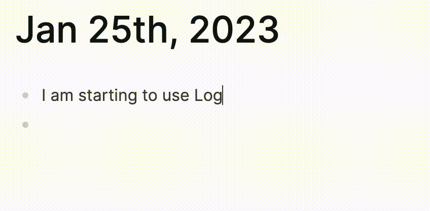

# Logseq-markers-plugin

This plugin uses simple commands to add inline markers in your paragraph.
It's a tool to help you to easily add markers to your note, to make your life easier.

## How to use it

Just type a command starting with a slash `/` and some keywords, it will pop out.

For example, you can type `/why`, and the complete format of the `WHY` maker will show up: `❓ Why, but why`, type 
enter, done.

## What it looks like

## How to install

*This plugin is not mature right now, therefore, it's not ready to be added to marketplace*

However, you can still manually install it!

### Manually Install

1. Logseq: Developer mode
2. Download the latest release of `Logseq-markers-plugin`, move to your favorite place, unzip it. 
3. Logseq -> Plugins -> Load Unpacked Plugin -> Select the unzipped folder -> You're done!

## License
MIT

